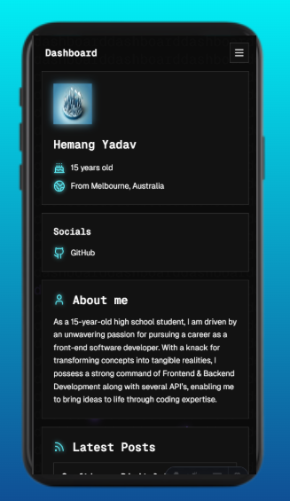

<div align = "center">


<br> 

<br />


# Zemerik's Dashboard

A Unified Digital Identity Hub


</div>


## ❗About:

Step into a streamlined, modern hub where my digital identity comes to life. This dashboard is your gateway to exploring my professional journey, creative projects, and insightful blogs—all in one place. Built with TypeScript, Astro, and MDX, it combines sleek design with powerful functionality to deliver a seamless experience.

## ⭐ Key Features:

- Rich Markdown Support
- Comprehensive Work Experience Section
- Interactive & Dynamic Interface
- Mobile-Friendly & Responsive Design

## 💻 Screenshots:



## 🚀 Quick Start:

### Prerequisites:

- [NodeJS](https://nodejs.org) installed on your machine
- [GIT](https://git-scm.com) installed on your machine
- A Code Editor

### Cloning:

- To make a local copy of this Project on your machine, enter the following `GIT` Commmand in your Terminal:

```bash
git clone https://github.com/Zemerik/Dashboard && cd Dashboard
```

### Installing Dependencies:

- To run this project locally, we first need to download a few `npm` dependencies by using the command below:

```bash
npm i
```

### Locally Running:

- We can locally run this Project on our Network and see the output using the following Command of `NodeJS`:

```bash
npm run dev
```

## 😎 Happy Coding!!

## 🚀 Project Structure:

```text
├── public/
│   ├── fonts/
│   ├── img/
├── package/
│   ├── src/
├── src/
│   ├── assets/
│   ├── components/
│   ├── content/
│   ├── layout/
│   ├── pages/
│   ├── scripts/
│   └── styles/
├── .gitignore
├── astro.config.ts
├── biome.json
├── README.md
├── CODE_OF_CONDUCT.md
├── CONTRIBUTING.md
├── SECURITY.md
├── Licence
├── package.json
├── package-lock.json
├── pnpm-lock.yaml
└── tsconfig.tson
```

## 🤝 Contributing:

Contributions are always welcome and appreciated! **Kindly visit the [CONTRIBUTING.md](https://github.com/Zemerik/Dashboard/blob/main/CONTRIBUTING.md) file for more information**

## 💁 Support:

For any kind of support or inforrmation, you are free to join our **Discord Server**,

<a href = "https://discord.gg/UF9KsmuGbr">
  
</a>

#

<p align = "center">
  Don't forget to leave a ⭐
  <br>
  Made with 💖 by <a href = "https://github.com/Zemerik">Hemang Yadav (Zemerik)</a>
</p>